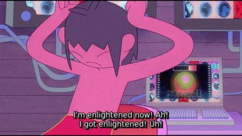

<!--
**LuigiSS97/LuigiSS97** is a ✨ _special_ ✨ repository because its `README.md` (this file) appears on your GitHub profile.

Here are some ideas to get you started:

- 🔭 I’m currently working on ...
- 🌱 I’m currently learning ...
- 👯 I’m looking to collaborate on ...
- 🤔 I’m looking for help with ...
- 💬 Ask me about ...
- 📫 How to reach me: ...
- 😄 Pronouns: ...
- ⚡ Fun fact: ...
-->

  <h1 align="center">Hey 👋, I'm Luigi Souza Scipioni</h1>
  <h3>It's great to have you here, let me tell you a little bit about myself </h2>

  

I'm a 3 years experienced brazilian Frontend developer aspiring to know all parts of the development process of a product, currently learning backend development 🧔🏽 .
🧑‍🤝‍🧑 People and social interactions are the things I mostly enjoy, so expect communication, presentation, knowledge transfer, collaboration and problem solving to be my best soft skills. I'm proudly part of <a href="https://github.com/he4rt">He4rt 💜</a> devs community and currently trying to be as interactive as I can, since social skills are the ones I'm mostly good at, I'm aiming to help educate and contribute with content and knowledge.  
In addition to that, I have some projects/deliveries which are my 🏆, to know more about them, access my updated <a href="https://docs.google.com/document/d/12FnUtZRDL4SuFoWloi4e5T3OuY--CzlMPCYi7neOlqw/edit?usp=drive_link">CV</a>  

  

- 🌱 I’m currently learning **Node Js, Express, Typeorm, GraphQl**

- 📝 I regularly write articles on [https://dev.to/luigiss97](https://dev.to/luigiss97)

- 💬 Ask me about **React, CSS in Js, Typescript, CMS, tests**

- ⚡ Fun fact **- I'm a urban dance dancer, specially hip hop and african dances, and I'm proudly part of a local studio called RJ studio.**
  

<h3 align="left">Connect with me:</h3>

<h3 align="left">Languages and Tools:</h3>

                    

  
  

### Blogs posts
<!-- BLOG-POST-LIST:START -->
<!-- BLOG-POST-LIST:END -->
